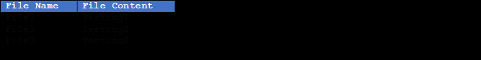

# Project Title : Retrive duplicate files from the File System

### Objective : Get duplicate files from the File System and compare the data structure

### Task :  Compare for loop, arrayList and LinkedList Data Structures

* Array is faster than ArrayList but consumes more memory
Even though Arrays are faster than ArrayLists, fast execution consumes more 
memory than ArrayList. Which is why in this example the performance of the Array is slower.
https://medium.com/lets-do-it-pl/arrays-vs-arraylist-99b3d845e404

* ArrayList is faster than LinkedList
Accessing elements from the list implemented using ArrayList is faster as
it has an index-based data structure. On the other hands, 
there is no index based structure in the list implement by LinkledList. 
Hence, an iterator is applied over the list to reach the 
element to be accessed which makes accessing slower in LinkedList.
https://techdifferences.com/difference-between-arraylist-and-linkedlist-in-java.html

### Technologies
* Java 12
* Lombok

### How to clone and run the project
* Clone the project : git clone git@github.com:khokhonir/Duplicate_Files.git
* Right click on the main class (DuplicateFilesMainClass.java) and press run

### Results :
* Compared Files 

    
  
* Data Structure Comparison

* Unit Tests
  Test files are available under the test package
  
* Console Results
* 
[main] INFO com.example.DuplicateFilesUsingArrayAndForLoop -
Duplicate Files Using For Loop  and Array
[main] INFO com.example.DuplicateFilesUsingArrayAndForLoop - The grouped duplicate file paths are : C:\dev\duplicateFiles\testingFiles\file2.txt and C:\dev\duplicateFiles\testingFiles\file3.txt
[main] INFO com.example.DuplicateFilesMainClass - Loop : For , Data Structure : Array , Processing time in milli seconds : 402

[main] INFO com.example.DuplicateFilesUsingArrayListAndForLoop -
Duplicate Files Using For Loop  and Arraylist
[main] INFO com.example.DuplicateFilesUsingArrayListAndForLoop - The grouped duplicate file paths are : C:\dev\duplicateFiles\testingFiles\file2.txt and C:\dev\duplicateFiles\testingFiles\file3.txt
[main] INFO com.example.DuplicateFilesMainClass - Loop : For , Data Structure : ArrayList , Processing time in milli seconds : 7

[main] INFO com.example.DuplicateFilesUsingLinkedListAndForLoop -
Duplicate Files Using For Loop  and Linkedlist
[main] INFO com.example.DuplicateFilesUsingLinkedListAndForLoop - The grouped duplicate file paths are : C:\dev\duplicateFiles\testingFiles\file2.txt and C:\dev\duplicateFiles\testingFiles\file3.txt
[main] INFO com.example.DuplicateFilesMainClass - Loop : For , Data Structure : LinkedList , Processing time in milli seconds : 10